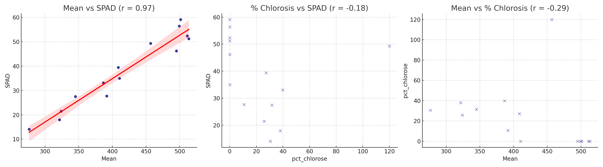

# Lyra_SPAD_RGB – Corrélation low-tech entre la verdeur foliaire et les valeurs SPAD

## 🌿 Objectif
Ce projet démontre la faisabilité de prédire les valeurs SPAD (proxy de densité en chlorophylle) en utilisant des mesures low-cost basées sur l’imagerie :
- Densité verte issue de feuilles scannées (ImageJ),  
- Surface et zones chlorotiques (MesurimPro),  
- Données de référence d’un appareil SPAD (Konica Minolta SPAD-502).  

## 🔬 Résumé du protocole

Une image scannée de 15 feuilles a été analysée (300 DPI).  
Le jeu de données est constitué uniquement de feuilles de lierre (*Hedera helix*), collectées pour l’analyse de la densité en chlorophylle.  

- DO_green (densité optique verte) calculée avec ImageJ,  
- Surfaces (totales et chlorotiques) mesurées avec MesurimPro,  
- Valeurs SPAD mesurées 3 fois par feuille puis moyennées,  
- Données compilées dans un fichier Excel structuré.  

Un échantillon chlorotique aberrant a été exclu (biais jaune dans la détection).  
Les corrélations entre DO_green, SPAD et % chlorose ont été explorées via GPT-4o.  
👉 L’analyse identifie la meilleure combinaison d’indicateurs low-tech pour évaluer l’état chlorophyllien.

---

## 📈 Graphiques de corrélation

Le graphique suivant montre les corrélations de Pearson entre DO_green (ImageJ), % chlorose (MesurimPro) et valeurs SPAD.



🟥 Ligne rouge : ajustement par régression linéaire  
**Équation** : SPAD = 0.178 × Mean − 36.454

## 📈 Résultats
| Paire de variables        | r de Pearson | Interprétation                        |
|---------------------------|--------------|--------------------------------------|
| DO_green ↔ SPAD           | +0.97        | ✅ Corrélation positive très forte     |
| % Chlorose ↔ SPAD         | –0.18        | ❌ Pas de corrélation significative    |
| DO_green ↔ % Chlorose     | –0.29        | ❌ Corrélation négative faible         |

## ✅ Points clés
- DO_green (ImageJ) est un substitut fiable des valeurs SPAD.  
- MesurimPro est précis pour les mesures de surface foliaire.  
- Le SPAD peut être approximé par analyse d’images RGB en contexte low-tech.  

---

## 🧪 Justification scientifique

Bien que la mesure directe de la chlorophylle totale (a + b) via extraction chimique et chromatographie sur couche mince (TLC) soit possible, elle requiert :  
- Des solvants dangereux (éther de pétrole, cyclohexane),  
- Du matériel de laboratoire et des protocoles de sécurité,  
- Une préparation fastidieuse des échantillons.  

Ici, l’approche repose sur :  
- Des relations empiriques publiées (ex. 50 SPAD ≈ 600–800 µg Chl/g MS),  
- Une forte corrélation (r = 0.97) entre la verdeur mesurée par imagerie et les valeurs SPAD.  

👉 Méthode plus sûre, simple et reproductible, adaptée à la science citoyenne et au terrain.

---

## 🧪 Expertise historique : Extraction de pigments et chromatographie (2007–2008)

Entre 2007 et 2008, j’ai développé un protocole complet pour identifier et doser 7–9 pigments photosynthétiques et accessoires (chlorophylles a, b, caroténoïdes, xanthophylles, anthocyanes) via TLC et extraction par solvants (acétonne).  

Le protocole impliquait :  
- Extraction avec Ultra-Turrax ou Potter-Elvehjem dans des tubes Eppendorf (1 mL solvant),  
- Travail sous hotte ventilée, masque obligatoire (solvants volatils/inflammables),  
- Résultats spectaculaires sous UV (fluorescence rouge intense des chlorophylles).  

Bien que pleinement opérationnel, ce protocole est sensible chimiquement et peu adapté au terrain. Aujourd’hui, je privilégie une alternative low-tech assistée par IA : capteurs SPAD, scans RGB et indices de verdeur.

👉 Ce choix repose sur accessibilité, reproductibilité et compatibilité éthique avec la science citoyenne, tout en gardant une base solide en chimie des pigments.

---

## 🔬 Protocole TLC – Compétences de laboratoire historiques (2007–2008)

Cette section illustre un protocole complet d’extraction et séparation des pigments, documenté par des photos originales et mené de manière autonome mais rigoureuse.

### ⚖️ Préparation des échantillons et extraction des pigments

🔗 [Sample_weighing.jpg](TLC_analysis_protocol/Sample_weighing.JPG)  
*Pesée d’échantillon sur balance analytique (±0,0001 g). Mesure précise de matière sèche pour quantification chlorophyllienne.*  

🔗 [Acetone_Eppendorf_leaf.jpg](TLC_analysis_protocol/Acetone_Eppendorf_leaf.JPG)  
*Injection d’acétone froid dans un tube Eppendorf contenant un échantillon de feuille. Première étape d’extraction des pigments avant homogénéisation.*  

🔗 [Potter_extraction_wooden_support.jpg](TLC_analysis_protocol/Potter_extraction_wooden_support.JPG)  
*Support en bois artisanal pour maintenir le tube lors de l’homogénéisation avec Potter-Elvehjem. Garantit verticalité et sécurité.*  

### 🌈 Migration des pigments et fluorescence UV (TLC)

🔗 [TLC_pigments_UV.jpg](TLC_analysis_protocol/TLC_pigments_UV.JPG)  
*Plaque TLC sous UV : pigments chlorophylliens et caroténoïdes visibles après migration.*  

🔗 [TLC_pigments_UV_2.jpg](TLC_analysis_protocol/TLC_pigments_UV_2.JPG)  
*Plaque TLC sous UV 254 nm inhibiteur. Zones fluorescentes marquées et identifiées.*  

🔗 [TLC_pigments_UV_3.jpg](TLC_analysis_protocol/TLC_pigments_UV_3.JPG)  
*Vue alternative des bandes pigmentaires TLC sous UV. Signal clair confirmant pureté et séparation.*  

🔗 [Chlorophyll_shines_red_UV.jpg](TLC_analysis_protocol/Chlorophyll_shines_red_UV.JPG)  
*Fluorescence rouge caractéristique de la chlorophylle sous UV, confirmant présence de molécules intactes.*  

💡 Solvant utilisé : 6 parts éther de pétrole, 4 parts acétone, 1 part cyclohexane → séparation optimale des chlorophylles et caroténoïdes.  
💡 Les plaques TLC développées ont été scannées et analysées sous ImageJ pour générer chromatogrammes et quantifications par aire sous la courbe (AUC).  

### 🔎 Spectroscopie et vérification optique

🔗 [Chlorophyll_homeMade_spectroscope.jpg](TLC_analysis_protocol/Chlorophyll_homeMade_spectroscope.JPG)  
*Spectre d’absorbance observé avec un spectroscope artisanal à diffraction.*  

🔗 [HomeMade_spectroscope.jpg](TLC_analysis_protocol/HomeMade_spectroscope.JPG)  
*Vue complète du spectroscope artisanal (tube PVC, fente réglable, réseau de diffraction, lentille).*  

### 🧪 Infrastructure de laboratoire

🔗 [Lab_footage_1.jpg](TLC_analysis_protocol/Lab_footage_1.JPG)  
*Zone d’analyse chimique : centrifugeuse, verrerie, solvants, paillasse.*  

🔗 [Lab_footage_2.jpg](TLC_analysis_protocol/Lab_footage_2.JPG)  
*Poste informatique : scanner, ordinateur et traitement des données intégré au protocole.*  

---

## 🧠 Utilisation suggérée du protocole DO_green (scanner à plat)

- Éducation et formation en physiologie végétale et agroécologie,  
- Détection du stress foliaire,  
- Base pour modéliser la NPP (Net Primary Production) dans des systèmes low-input.  

---

## 📁 Structure du dépôt

```
Lyra_DO_Green_Mesurim/
├── TLC_analysis_protocol/   # 🌿 Documentation extraction de pigments et protocole TLC
│   ├── Acetone_Eppendorf_leaf.JPG      # Acétone injecté dans tube Eppendorf pour extraction
│   ├── Chlorophyll_homeMade_spectroscope.JPG # Spectre brut de chlorophylle observé (spectroscope artisanal)
│   ├── Chlorophyll_shines_red_UV.JPG   # Fluorescence rouge de la chlorophylle sous UV
│   ├── HomeMade_spectroscope.JPG       # Vue générale du spectroscope artisanal
│   ├── Lab_footage_1.JPG / Lab_footage_2.JPG # Photos du labo maison (2008)
│   ├── Potter_extraction_wooden_support.JPG # Support en bois pour extraction avec Potter
│   ├── Sample_weighing.JPG             # Pesée d’échantillon avec balance de précision
│   ├── TLC_pigments_UV.JPG             # Pigments après migration TLC, sous UV
│   ├── TLC_pigments_UV_2.JPG           # Deux plaques TLC fluorescentes (concentrations marquées)
│   └── TLC_pigments_UV_3.JPG           # Bandes TLC juxtaposées montrant migration ascendante
│
├── pictures/   # 🍃 Étude de chlorose foliaire et extraction numérique
│   ├── Planche_initiale_réduite.jpg    # 15 feuilles de lierre avec degrés de chlorose variés (SPAD notés)
│   ├── miniwebtool.png                 # Capture interface de découpage MiniWebTool
│   └── regressions.png                 # Résultats de régression (DO_green vs SPAD)
│
├── Results/    # 📊 Données finales issues des analyses image + SPAD
│   └── Results_completed.xls           # Tableau : DO_green, surfaces chlorotiques/totales, SPAD moyen
│
├── README.md    # 📄 Documentation principale (anglais)
└── README_fr.md # 📄 Documentation traduite en français (ce fichier)
```

---

## 🔖 Licence
Licence MIT – science ouverte, écologie ouverte.
